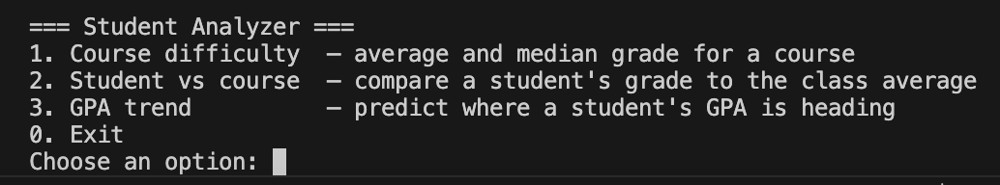
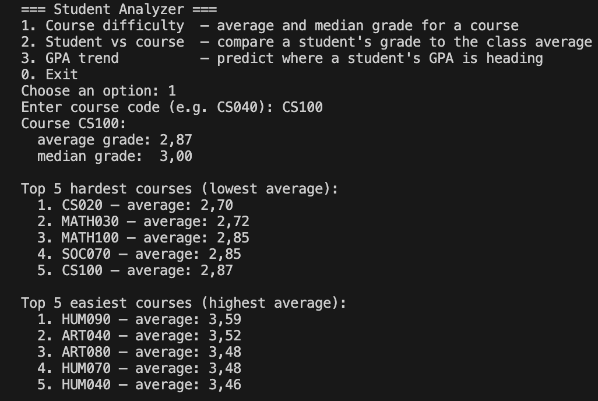
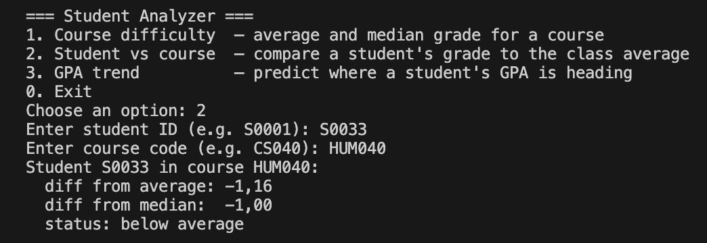
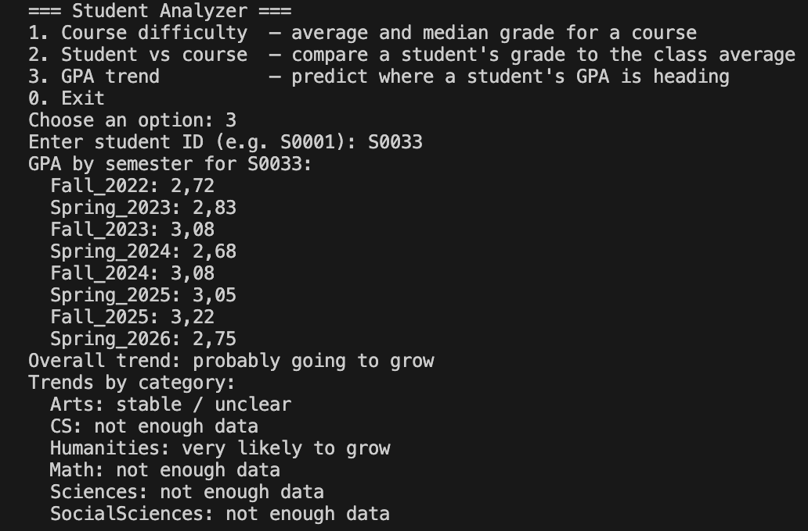
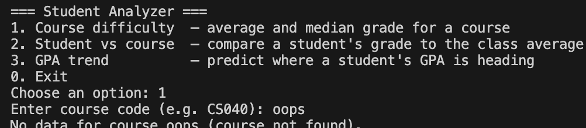

# Student Analyzer

A Java program that analyzes the academic data of students from one university. It helps students choose courses, compare their performance to the course average, and predict where their GPA is heading based on their semester history.



## Features

The program has three features, accessible through an interactive menu.

### 1. Course difficulty analysis
Calculates the average and median grade for any course across all students who have taken it, and shows the top 5 hardest and top 5 easiest courses for convenient comparison with the grade of the course chosen by the user. Useful for students who want to take a course outside their main specialization and want to estimate the entry barrier.



### 2. Student vs course comparison
Compares an individual student's grade in a specific course to the class average and median. The student sees whether they performed above or below the average, while data about other students is not revealed — the comparison is private.



### 3. GPA trend prediction
Predicts where a student's GPA is heading, based on the direction of change between semesters. The prediction is given both overall and broken down by category (CS, Math, Arts, etc.). For categories with less than three semesters of data, the program returns "not enough data" instead of guessing.



The program also correctly handles invalid input at any moment of its work — for example, a request for a course that doesn't exist:




## How to Run

### Requirements
- Java JDK 11 or higher
- No external libraries required

### Run from VS Code
Open `Main.java` and click ▶ Run above the `main` method. By default, the dataset from `data/students_dataset.csv` will be loaded.

### Run from the terminal
From the project root:
```bash
cd src
javac studentanalyzer/*.java
java studentanalyzer.Main
```

### Run with your own dataset
Pass the path to your CSV file as a command line argument:
```bash
java studentanalyzer.Main path/to/your_file.csv
```

If the path is invalid, the program will warn you about it and load the default dataset.


## Dataset Format

The program expects a CSV file with the following columns:

student_id,year_level,semester,course_code,course_name,category,grade
S0001,Senior,Fall_2022,CS040,Computer Systems,CS,3.3

Important:
- `semester` must be in the `Season_Year` format (for example `Fall_2022`, `Spring_2023`), otherwise Feature 3 will not be able to parse the order of semesters.
- `grade` is on a 0.0–4.0 scale.
- Fields are separated by commas, and the first line is the header.


## Project Structure

student-analyzer/
├── data/
│   └── students_dataset.csv       <- default dataset
├── images/                        <- screenshots for the README
├── src/
│   └── studentanalyzer/
│       ├── Main.java                  <- entry point
│       ├── StudentAnalyzer.java       <- interface
│       ├── StudentAnalyzerImpl.java   <- implementation
│       ├── Student.java               <- helper class
│       └── CourseRecord.java          <- helper class
└── README.md

## Public API

The main class is `StudentAnalyzerImpl`, which implements the `StudentAnalyzer` interface.

### Constructor

#### `StudentAnalyzerImpl()`
Creates an empty analyzer.

**Example:**
```java
StudentAnalyzerImpl analyzer = new StudentAnalyzerImpl();
```


### Data loading

#### `loadFromCSV(String filename)`
Loads student data from a CSV file into memory.
- **Input:** path to the CSV file
- **Output:** nothing (void)

**Example:**
```java
analyzer.loadFromCSV("data/students_dataset.csv");
```

#### `getStudentCount()`
Returns the total number of unique students in the dataset.
- **Input:** nothing
- **Output:** `int`

**Example:**
```java
int count = analyzer.getStudentCount();   // returns 100
```

#### `getStudentCourses(String studentId)`
Returns the list of course codes that a student has taken.
- **Input:** student ID
- **Output:** `ArrayList<String>` of course codes (empty if the student is not found)

**Example:**
```java
ArrayList<String> courses = analyzer.getStudentCourses("S0001");
// returns ["ART040", "CS040", "MATH010", "SCI060", ...]
```


### Feature 1: course difficulty

#### `getAverageGradeForCourse(String courseCode)`
Calculates the average grade for a course across all students who have taken it.
- **Input:** course code (for example `"CS040"`)
- **Output:** `double` on a 0.0–4.0 scale (returns 0.0 if the course is not found)

**Example:**
```java
double avg = analyzer.getAverageGradeForCourse("CS100");   // returns 2.87
```

#### `getMedianGradeForCourse(String courseCode)`
Calculates the median grade for a course across all students who have taken it.
- **Input:** course code
- **Output:** `double` on a 0.0–4.0 scale (returns 0.0 if the course is not found)

**Example:**
```java
double med = analyzer.getMedianGradeForCourse("CS100");   // returns 3.00
```

#### `getHardestCourses(int n)`
Returns the top-N courses with the lowest average grade.
- **Input:** number of courses
- **Output:** `ArrayList<String>` of course codes, sorted from the hardest

**Example:**
```java
ArrayList<String> hardest = analyzer.getHardestCourses(5);
// returns ["CS020", "MATH030", "MATH100", "SOC070", "CS100"]
```

#### `getEasiestCourses(int n)`
Returns the top-N courses with the highest average grade.
- **Input:** number of courses
- **Output:** `ArrayList<String>` of course codes, sorted from the easiest

**Example:**
```java
ArrayList<String> easiest = analyzer.getEasiestCourses(5);
// returns ["HUM090", "ART040", "ART080", "HUM070", "HUM040"]
```


### Feature 2: student vs course comparison

#### `compareStudentToCourseAverage(String studentId, String courseCode)`
Returns the difference between the student's grade for a course and the average grade for that course.
- **Inputs:** student ID, course code
- **Output:** `double` — positive if above the average, negative if below, 0.0 if the student did not take this course

**Example:**
```java
double diff = analyzer.compareStudentToCourseAverage("S0033", "HUM040");
// returns -1.16  (the student got a grade 1.16 below the class average)
```

#### `compareStudentToCourseMedian(String studentId, String courseCode)`
The same, but compared to the median.
- **Inputs:** student ID, course code
- **Output:** `double` — positive if above the median, negative if below

**Example:**
```java
double diff = analyzer.compareStudentToCourseMedian("S0033", "HUM040");
// returns -1.00
```


### Feature 3: GPA trend prediction

#### `predictGPATrend(String studentId)`
Predicts where the student's overall GPA is heading.
- **Input:** student ID
- **Output:** `String` — one of the following:
  - `"very likely to grow"` (the last 3 semesters all went up)
  - `"very likely to decline"` (the last 3 semesters all went down)
  - `"probably going to grow"` (more upward changes than downward)
  - `"probably going to decline"` (more downward changes than upward)
  - `"stable / unclear"` (equal number of ups and downs)
  - `"not enough data"` (less than 2 semesters)
  - `"student not found"`

**Example:**
```java
String trend = analyzer.predictGPATrend("S0033");
// returns "probably going to grow"
```

#### `predictCategoryTrends(String studentId)`
Returns the same trend prediction, but broken down by category. A category needs at least 3 semesters of data, otherwise `"not enough data"` is returned.
- **Input:** student ID
- **Output:** `HashMap<String, String>` — category name → trend description

**Example:**
```java
HashMap<String, String> trends = analyzer.predictCategoryTrends("S0033");
// {"Arts": "stable / unclear",
//  "CS": "not enough data",
//  "Humanities": "very likely to grow",
//  "Math": "not enough data", ...}
```

#### `getSemesterGPAList(String studentId)`
Returns the student's GPA per semester in chronological order.
- **Input:** student ID
- **Output:** `ArrayList<String>` in the format `"Semester: GPA"`

**Example:**
```java
ArrayList<String> gpas = analyzer.getSemesterGPAList("S0033");
// ["Fall_2022: 2.72", "Spring_2023: 2.83", "Fall_2023: 3.08", ...]
```

